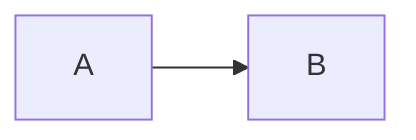

# test-mermaid-js

Ref: [Mermaid Diagrams Setup](https://gist.github.com/denqiu/15641b2226288073c394a2a72b111f9b)

The following code-block will be rendered as a Mermaid diagram:

```mermaid
flowchart LR
  A --> B
```
